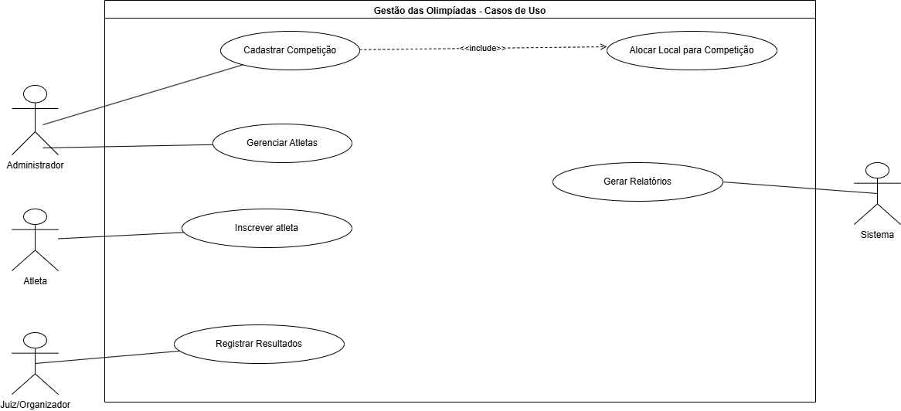
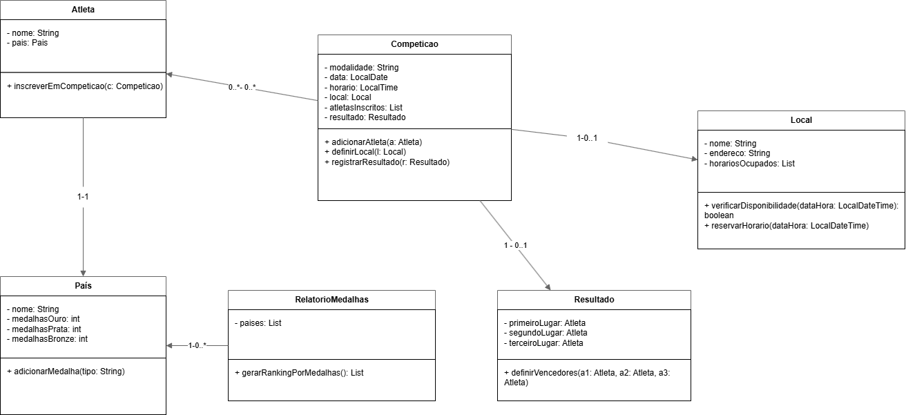

# 🏆 Sistema de Gestão das Olimpíadas (SGO)

## ✨ Visão Geral do Projeto

Este projeto consiste na modelagem em UML (Linguagem de Modelagem Unificada) do **Sistema de Gestão das Olimpíadas (SGO)**, desenvolvido como primeira entrega da disciplina de Projeto de Software.

O SGO é um sistema fundamental para **coordenar e gerir** os diversos aspectos de um evento olímpico.

### 🔑 Funcionalidades Chave (Regras de Negócio)

1.  **Gerenciamento de Competições:** Cadastro detalhado de modalidades, datas, horários e locais.
2.  **Inscrição de Atletas:** Controle da participação de atletas de diferentes países em diversas modalidades.
3.  **Alocação Inteligente de Locais:** Distribuição de locais para provas, evitando conflitos de horário.
4.  **Controle de Resultados:** Registro dos vencedores (1º, 2º e 3º lugares) após cada competição.
5.  **Relatórios de Medalhas:** Geração de rankings de desempenho por país (Ouro, Prata e Bronze).

## 🚀 Histórias de Usuário (User Stories)

As Histórias de Usuário (US) formalizam os requisitos funcionais do sistema, baseadas nas Regras de Negócio:

| ID | Papel (Actor) | Ação (Goal) | Benefício (Reason) |
| :--- | :--- | :--- | :--- |
| **US01** | Administrador | Quero cadastrar uma nova competição, com data, horário e modalidade. | Para que o evento seja oficialmente registrado no sistema. |
| **US02** | Atleta | Quero me inscrever em competições específicas, representando apenas um país por modalidade. | Para que minha participação seja validada e registrada corretamente. |
| **US03** | Administrador | Quero alocar um local para uma competição, garantindo que não haja conflitos de horário. | Para organizar a logística e evitar sobreposição de eventos no mesmo local. |
| **US04** | Administrador / Juiz | Quero registrar os resultados de uma competição (1º, 2º e 3º lugares). | Para manter o controle oficial e a classificação dos vencedores. |
| **US05** | Administrador | Quero gerar relatórios de medalhas por país. | Para acompanhar o desempenho geral e visualizar o ranking de nações. |

## 📐 Modelagem UML

O sistema foi modelado utilizando os seguintes diagramas UML, conforme solicitado.

**Estrutura do Repositório:**
* As imagens em formato `.png` estão na pasta: `/imagens`
* Os arquivos de projeto (`.drawio` ou `.astah`) estão na pasta: `/modelagens`

---

### 1. Diagrama de Caso de Uso

**Foco:** Modelar os casos de uso principais (`Cadastrar Competição`, `Inscrever Atleta`, `Alocar Local`, `Registrar Resultados`) e identificar os atores.

---

### 2. Diagrama de Classes e Diagrama de Pacotes

**Foco:** Refletir a estrutura do sistema (Classes como `Competição`, `Atleta`, `Local`, `Resultado` e `País`) e organizar as responsabilidades em pacotes lógicos.

#### **Diagrama de Classes**

#### **Diagrama de Pacotes**

---

### 3. Diagrama de Componentes

**Foco:** Modelar os componentes principais (`Interface de Usuário`, `Módulo de Inscrições`, `Módulo de Alocação`, `Módulo de Relatórios`) e suas interações.

---

### 4. Diagrama de Implantação

**Foco:** Ilustrar a arquitetura física do sistema, incluindo a distribuição dos componentes em servidores, bancos de dados e dispositivos de usuário.

